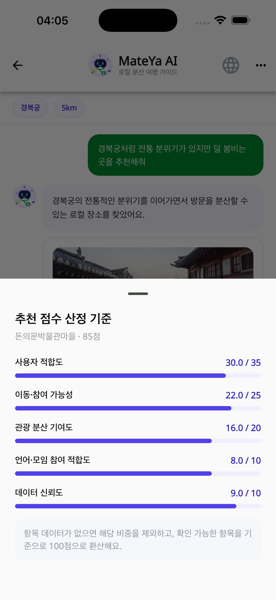
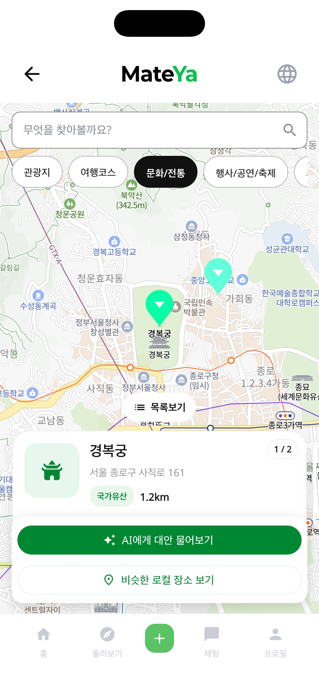
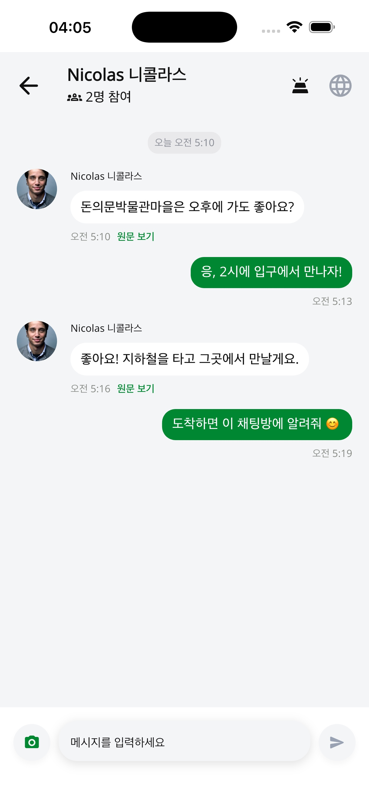

# Mateya Frontend

Mateya는 한국을 여행하거나 생활하는 외국인과 로컬을 연결하는 관광·문화 동행 앱입니다. 공공 관광데이터와 AI 추천으로 붐비는 유명 관광지 대신 비슷한 경험의 로컬 장소를 발견하고, 해당 장소의 모임에 참여하거나 직접 만들 수 있습니다.

이 저장소는 Flutter 기반 iOS·Android 앱의 온보딩, AI 홈, 장소 탐색, 모임 생성·참여, 다국어 채팅과 마이페이지 경험을 담당합니다.

- App Store: [Mateya](https://apps.apple.com/kr/app/mateya/id6782392321)
- API 문서: [api.mateya.cloud/swagger](https://api.mateya.cloud/swagger)

## 주요 화면

<table>
  <tr>
    <td align="center"><br><sub>AI 여행 메이트 홈</sub></td>
    <td align="center"><br><sub>로컬 분산 추천</sub></td>
    <td align="center"><br><sub>추천 근거와 점수</sub></td>
  </tr>
  <tr>
    <td align="center"><br><sub>주변 로컬 지도</sub></td>
    <td align="center"><br><sub>AI 모임 만들기</sub></td>
    <td align="center"><br><sub>사용자 다국어 채팅</sub></td>
  </tr>
</table>

나머지 앱 화면은 [`docs/images/app`](docs/images/app)에서 확인할 수 있습니다.

## 사용자 흐름

```text
온보딩·로그인
  → AI 홈에서 유명 관광지 또는 여행 조건 입력
  → 혼잡도·유사 경험·이동성을 반영한 로컬 대안 확인
  → 추천 근거와 장소 상세 확인
  → 기존 모임 참여 또는 AI 도움으로 새 모임 생성
  → AI 여행 대화와 참여자 간 다국어 채팅
```

## 핵심 기능

### AI 로컬 분산 추천

- 유명 관광지를 기준으로 덜 붐비는 로컬 대안 장소 탐색
- 추천 점수와 혼잡도, 이동 거리, 경험 유사성 등 근거 표시
- 대화형 여행 조건 보완과 추천 이력 관리
- 장소 상세, 주변 지도, 모임 참여·생성 CTA 연결

### 장소와 모임

- 공공데이터 기반 관광지·문화시설·전통시장·행사 등 탐색
- 지도와 목록을 오가는 주변 장소 검색 및 카테고리 필터
- 장소 상세와 모임 상세를 분리한 탐색 흐름
- 일정, 인원, 언어, 소개를 포함한 모임·클래스 생성과 참여 관리

### 다국어 소통

- 한국어, 영어, 일본어, 중국어 간 앱 UI 전환
- REST + STOMP WebSocket 기반 AI 대화·모임 채팅·1:1 채팅
- 최초 요청 시 저장된 번역과 원문 보기 지원
- 신고, 차단, 참여자 관리 등 사용자 안전 기능

## 기술 스택

| 영역 | 기술 |
| --- | --- |
| 앱 | Flutter, Dart 3.12 |
| 상태·구조 | Feature-first, Application/Data/Domain/Presentation 분리 |
| 지도·위치 | Naver Map, Geolocator, Geocoding |
| 실시간 | STOMP WebSocket |
| 로컬 저장 | Flutter Secure Storage, SharedPreferences |
| 다국어 | Flutter Localizations, Intl |
| 관측성 | Firebase Crashlytics |

## 프로젝트 구조

```text
lib/
├── app/                 # 앱 부팅, 설정, 라우팅
├── features/
│   ├── ai/              # AI 홈, 추천, 대화
│   ├── chat/            # 모임·1:1 채팅
│   ├── create/          # 모임·클래스 생성
│   ├── details/         # 장소·모임 상세
│   ├── home/            # 홈과 탐색
│   ├── mypage/          # 프로필과 활동 이력
│   └── onboarding/      # 가입과 초기 설정
├── shared/              # 인증, 네트워크, 지도, 테마, 공통 위젯
└── l10n/                # 다국어 리소스
test/                    # 기능·공통 모듈 테스트
docs/images/app/          # README와 스토어용 앱 화면
```

## 로컬 실행

Flutter SDK와 Xcode 또는 Android Studio가 필요합니다.

```bash
flutter doctor
flutter pub get
flutter run
```

다른 API 서버를 사용할 때는 빌드 환경값으로 주입합니다.

```bash
flutter run --dart-define=MATEYA_API_BASE_URL=http://localhost:8080
```

Naver Map Client ID 등 환경별 값은 저장소에 시크릿으로 추가하지 말고 플랫폼 설정 또는 `--dart-define`으로 관리합니다.

## 품질 확인

```bash
dart format --output=none --set-exit-if-changed lib test
flutter analyze
flutter test
```

## 관련 저장소

- [Backend](https://github.com/mateya-project/backend)
- [AI Server](https://github.com/mateya-project/mateya-aiserver)
- [Infrastructure](https://github.com/mateya-project/infra)
